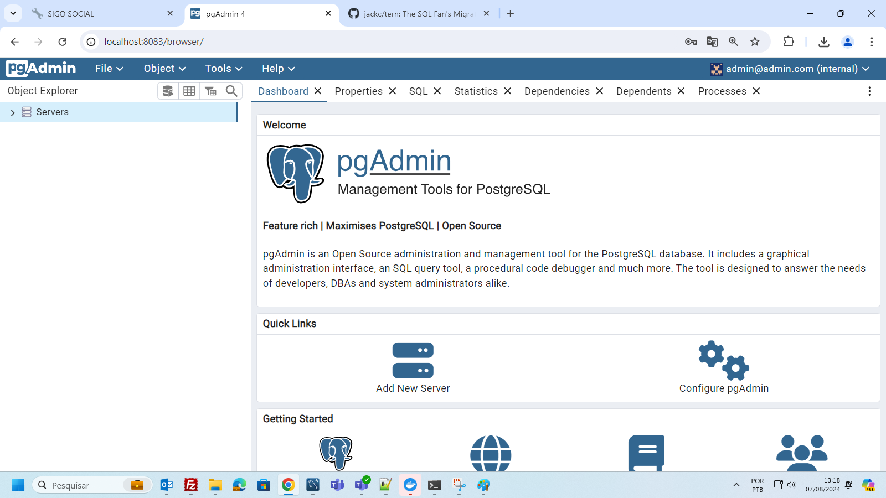
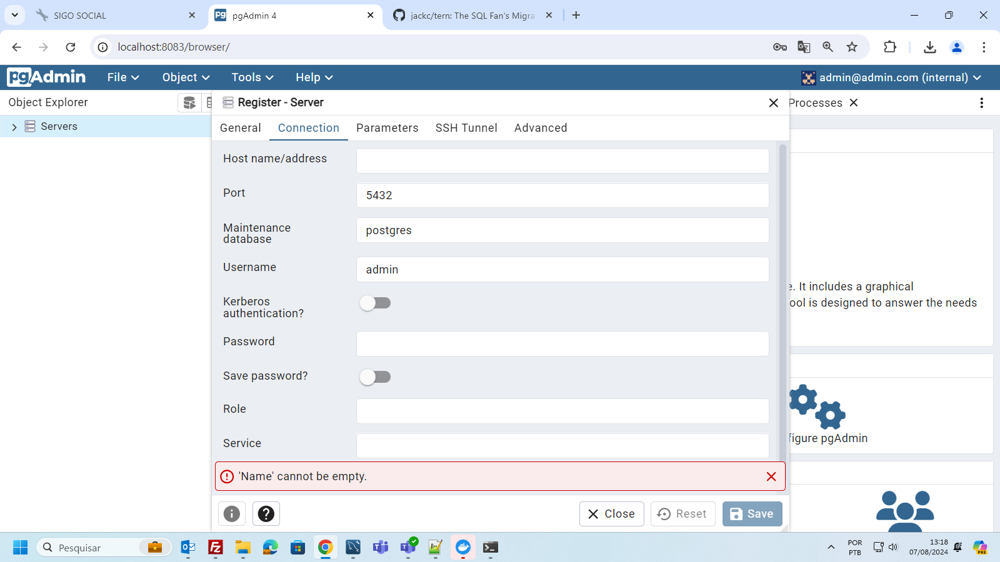
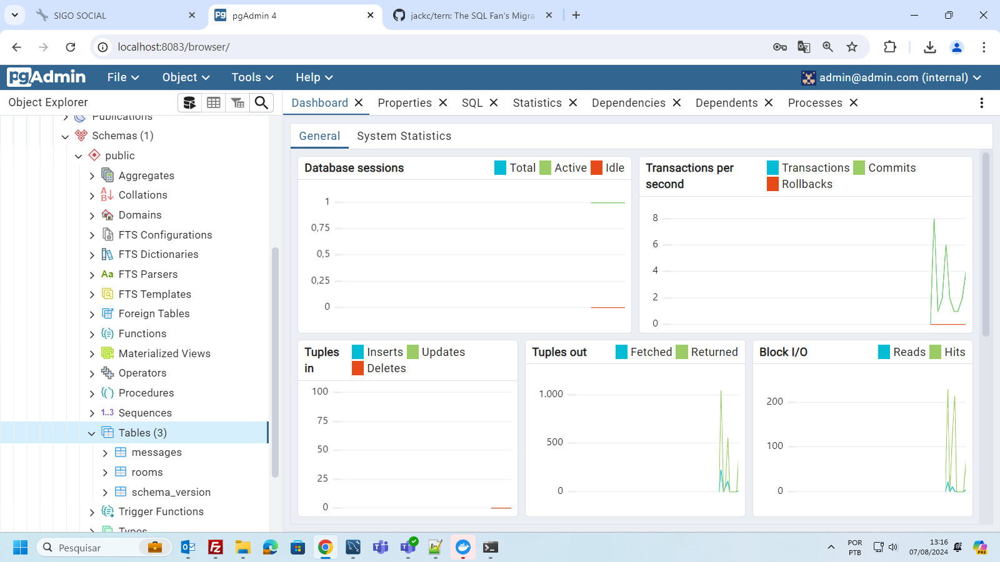

# GO+REACT ROCKETSEAT


Neste evento feito pela **Rocketseat** em agosto de 2024 foi feita a demonstração de uma aplicação em React consumindo um backend feito em Go com websockets.

Nos arquivos react.md e go.md existem algumas anotações feitas em aula.

## INSTALAÇÃO


### BACKEND

Foi necessário primeiro instalar o **Docker Destkop** e o **Go**.

Para instalar o backend será necessário subir primeiro um arquivo **Docker Compose** contendo um banco de dados Postgres e uma aplicação web para acessar este banco.

Como os testes foram feitos no **Windows 10**, foi necessário primeiro abrir o **Docker Desktop**. Depois de aberto, utilizando o terminal, foi executado o seguinte comando dentro da pasta onde está a aplicação backend.

```docker-compose up```

O arquivo com os containers docker que serão utilizados se chama **compose.yml**.

Para acessar o banco de dados você deve acessar 

```http://localhost:8083```

O login e senha para acessar esta aplicação, chamada pgAdmin4, se encontra no arquivo compose.yml na raiz do projeto backend. São os valores das variáveis PGADMIN_DEFAULT_EMAIL e PGADMIN_DEFAULT_PASSWORD



No arquivo go.mod localizado na raiz do projeto existem as dependências utilizadas na aplicação. Para instalar,  basta executar o seguinte comando no terminal

```go mod tidy```

Com o banco de dados no ar e as dependências da aplicação backend instaladas, será necessário rodar as migrations, ou seja, criar a estrutura de banco de dados que será utilizada pela aplicação.

Para isso, será necessário primeiro instalar o **TERN**

```go install github.com/jackc/tern/v2@latest```

Depois de instalado, basta executar o comando a seguir:

```go run cmd/tools/terndotenv/main.go```

Para validar se as tabelas foram criadas, dentro do pgAdmin que foi disponilizado pelo Docker, na tela inicial, clique em "Add New Server". Vá na aba "Connection" e informe os dados de login que estão no arquivo .env localizado na raiz do projeto. O nome do servidor é "db", que é o nome do serviço do Postgres informado no arquivo compose.yml. 



Para rodar a aplicação será necessário executar o seguinte comando:

```go install github.com/sqlc-dev/sqlc/cmd/sqlc@latest```



A API vai estar disponível na porta **8080**.


### FRONTEND

Será necessário instalar o **Node** e o **React**

Depois de instalados, acesse pelo terminal a pasta onde está o frontend e execute o seguinte comando:

```npm install --force```

Isso será necessário porque a versão do React foi alterada manualmente e algumas dependências não são compatíveis no momento com esta nova versão (19)

Para executar a aplicação frontend:

```npm run dev```

A aplicação web está disponível na porta **5173**

http://localhost:5173/

